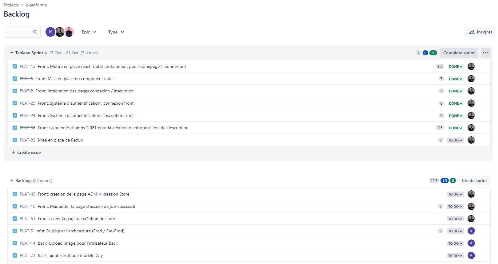
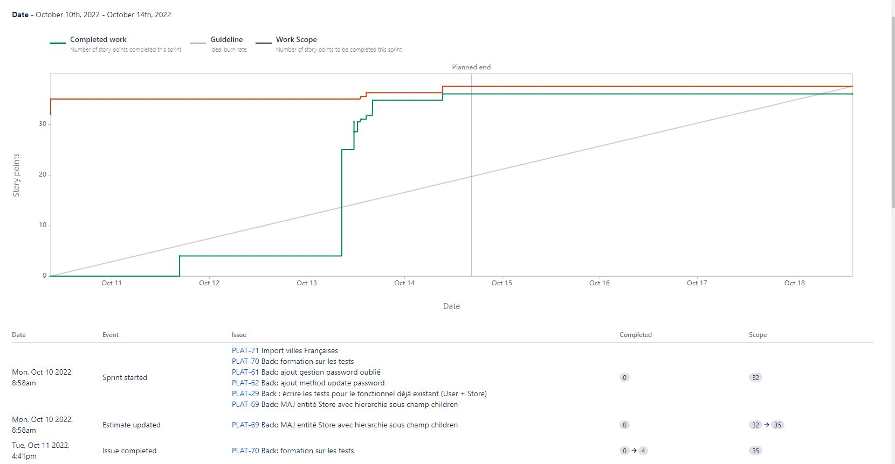

# Titre de la compétence

> ❌ A travailler

> ✔️ Auto validation par l'étudiant

## 🎓 J'ai compris et je peux expliquer

- Différence entre Agile et SCRUM ✔️

  L'agile est une méthodologie de travail. On divise l'objectif en plusieurs petites tâches, ce qui permet de simplifier le process et d'atteindre au mieux l'objectif visé par le client (possible d'adapter les tâches aux besoins du client au quotidien).
  SCRUM est un ensemble de règles à respecter lors du travail en méthodologie Agile afin d'assurer une livraison régulière et efficace des livrables au client.

- Expliquer les différents rituels et leur intérêt : ✔️

  - Daily Stand Up

    Prise de parole quotidienne pour expliquer son avancement personnel et les problèmes rencontrés.

  - Sprint planning

    Plannification du prochain sprint : on choisi les tâches du backlog à traiter en priorité sur le prochain sprint.

  - Retro

    On revient sur le sprint terminé pour en faire un bilan et essayer d'ajuster / améliorer les process.

  - Grooming

    On discute d'une tâche complexe et on cherche à la découper (grooming) en plusieurs petites pour que l'objectif soit facilement atteignable.

  - Poker planning

    Afin d'évaluer la vélocité des tâches du backlog, on utilise des cartes ayant chacune un numéro, et chacun dans l'équipe évalue le poids de la tâche en choisissant une carte (le numéro = le poids de la tâche). Tout le monde révèle sa carte en même temps. Permet d'évaluer le poids d'une tâche sans être influencé par les paroles des autres membres de l'équipe.

- Expliquer les différents roles ✔️

  - SCRUM master

    Veille au bon déroulé du sprint, gère la répartition du backlog en fonction de la vélocité de l'équipe, gère les cérémoniaux...

  - Product Owner

    S'assure que ce qui est produit répond correctement aux attentes du client. Il fait le lien entre le client et l'équipe technique en charge de la réalisation.

  - Stakeholder

    Personnes externes intéressées par le produit. Peut donner son avis et proposer de nouvelles User Stories pour améliorer le produit.

- Comment rédiger une User Story complète ? ✔️

  On utilise la syntaxe `ETQ (en tant que) <ROLE> je peux ...`. Par exemple : `ETQ Utilisateur, je peux accèder à la page détaillée d'un produit.`

- Qu'est-ce qu'un Product Backlog ? ✔️

  C'est l'ensemble des tâches à réaliser pour le projet.

- Qu'est ce qu'un Sprint ? Quel est l'intérêt ? ✔️

  Le sprint regroupe un ensemble de tâches du backlog à traiter en priorité. Il a une durée variable mais en général elle se situe autour de 2 semaines. L'objectif est de terminer les tâches présentes dans le sprint avant la fin de celui-ci : permet d'assurer un avancement sur le projet.

- A quoi sert le Burndown Chart ? ✔️

  Graphique qui permet de comparer le reste du travail à effectuer par rapport au travail effectué. Dans le cadre d'un projet SCRUM, on représente en général le poids des tâches restantes en fonction du temps, par rapport à la diagonale idéale (par du poids total au début du sprint et fini à 0 en fin de sprint)

- Quelles sont les 2 unités de complexité ? ✔️

  On peut utiliser des chiffres ou des tailles de T-shirt (S, M, L, XL...)

- Qu'est-ce qu'une Definition of done ? A quoi sert elle ? ✔️

  Pour une User Story, on montre l'ensemble des tâches. Certaines sont réalisées dans le sprint, d'autres toujours à faire. Cela permet de se rendre compte de ce qui a déjà été fait et donc de l'avancement.

## 💻 J'utilise

### Un exemple personnel commenté ❌ / ✔️

### Utilisation dans un projet ✔️

Description : Exemple du sprint 4 Jira en entreprise

### Utilisation en production si applicable❌ / ✔️

[lien (screenshot/photos)](...)

Description :

### Utilisation en environement professionnel ✔️

Description : Voir le screen à la partie "Utilisation dans un projet" qui provient du Jira de l'entreprise. Autre exemple : burnup report Jira sur le sprint 3 où j'étais presque seul

## 🌐 J'utilise des ressources

### SCRUM Guide

- https://www.scrum.org/resources/scrum-guide
- Guide de recommandations de l'application des principes SCRUM de scrum.org

## 🚧 Je franchis les obstacles

### Point de blocage ❌ / ✔️

Description:

Plan d'action : (à valider par le formateur)

- action 1 ❌ / ✔️
- action 2 ❌ / ✔️
- ...

Résolution :

## 📽️ J'en fais la démonstration

- J'ai ecrit un [tutoriel](...) ❌ / ✔️
- J'ai fait une [présentation](...) ❌ / ✔️
