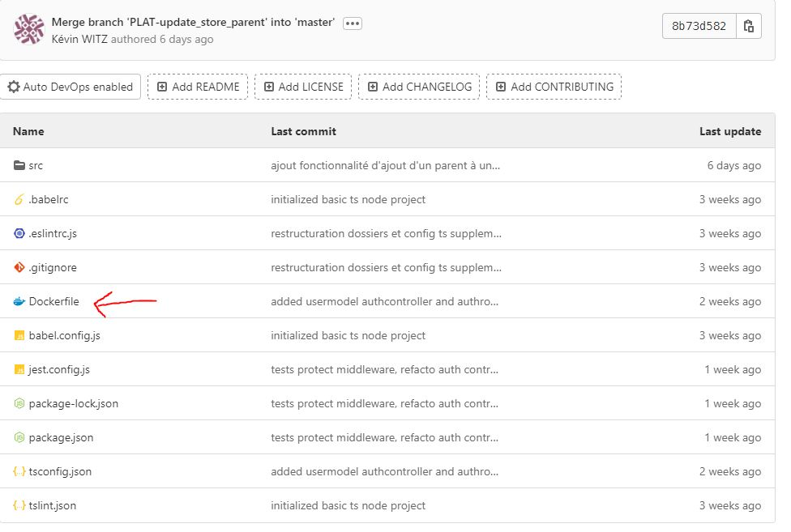
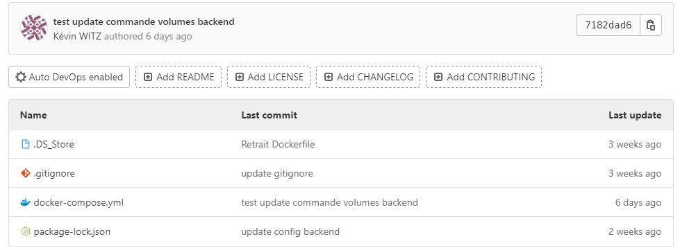

# Docker

> ❌ A travailler

> ✔️ Auto validation par l'étudiant

## 🎓 J'ai compris et je peux expliquer

- la création d'une image docker ✔️

  Le voir comme la capture à un instant T d'un projet. C'est un exécutable qui permettra de générer le projet en question dans cet état. C'est le fichier Dockerfile qui décrit comment construire l'image.

- l'éxécution d'un container ✔️

  Un container est une instance de l'exécution d'une image Docker.

- l'orchestration de containers avec docker-compose ✔️

  Pour gérer l'utilisation de plusieurs containers en même temps, on utilise un outil d'orchestration comme docker-compose. On peut écrire un fichier docker-compose.yml qui décrit comment générer les containers.

## 💻 J'utilise

### Un exemple personnel commenté ✔️

Exemple Dockerfile projet backend

```docker
# image de base
FROM node:lts-alpine

# on créer un dossier app et on le défini comme workdir, le reste des commandes est donc exécuté dans ce dossier
RUN mkdir /app
WORKDIR /app

# on copie d'abord package.json avec npm i pour ne réexecuter cette commande qu'en cas de changement de ce fichier (grâce au système de cache docker)
COPY package*.json ./
RUN npm i

# on récupère aussi le fichier tsconfig pour compiler le TS correctement
COPY tsconfig.json ./

# on copie les fichiers sources du projet. Ici de src/ vers app/src/
COPY src src

# après la compilation, on exécute la commande "start" de notre package.json
CMD npm start
```

### Utilisation dans un projet ✔️

[Wilders Book docker](https://github.com/witzkvn/20221020_wildersbook_docker)

Description : Projet Dockerizé wildersbook front et back. Voir la branche "postgres" pour l'utilisation d'un container postgres en plus.

### Utilisation en production si applicable❌ / ✔️

[lien du projet](...)

Description :

### Utilisation en environement professionnel ✔️



Description : Dockerization du projet plateforme avec un docker-compose à la racine, et un dockerfile dans chaque projet

Hiérarchie du projet plateforme :

- kitdocker (contient docker-compose)
  - kitback (contient Dockerfile)
  - kitfront (contient Dockerfile)

## 🌐 J'utilise des ressources

### Docker doc

- https://docs.docker.com/get-started/
- Get Started de docker

## 🚧 Je franchis les obstacles

### Point de blocage ❌ / ✔️

Description:

Plan d'action : (à valider par le formateur)

- action 1 ❌ / ✔️
- action 2 ❌ / ✔️
- ...

Résolution :

## 📽️ J'en fais la démonstration

- J'ai ecrit un [tutoriel](...) ❌ / ✔️
- J'ai fait une [présentation](...) ❌ / ✔️
